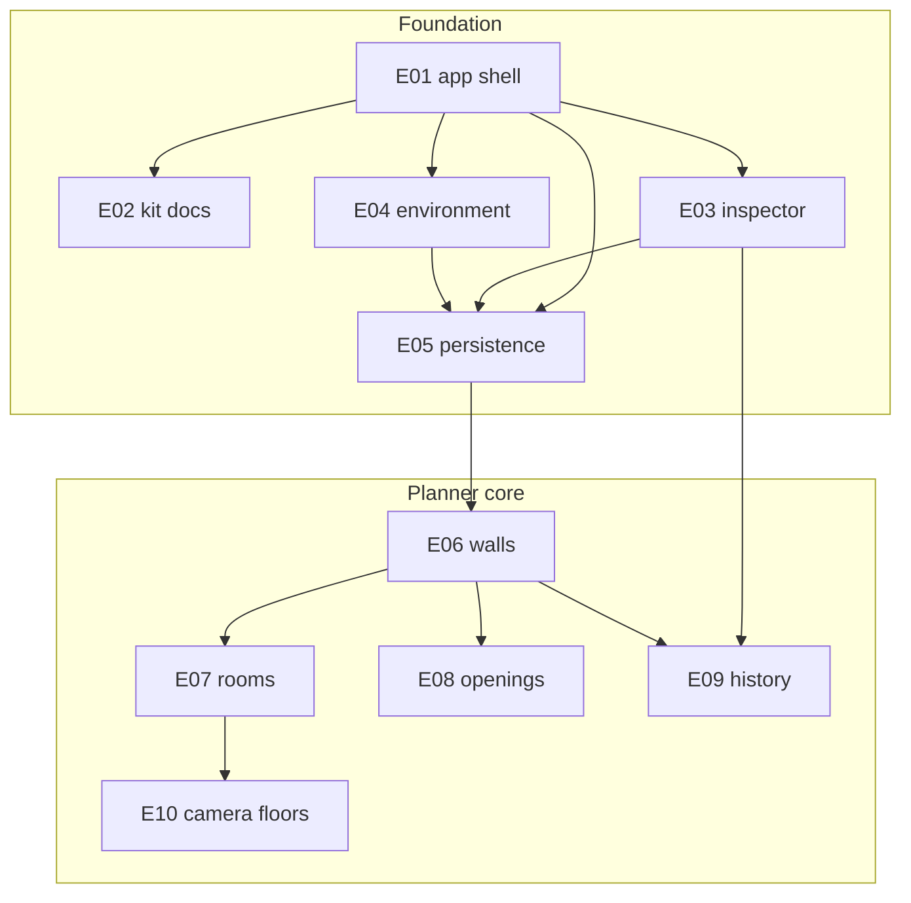
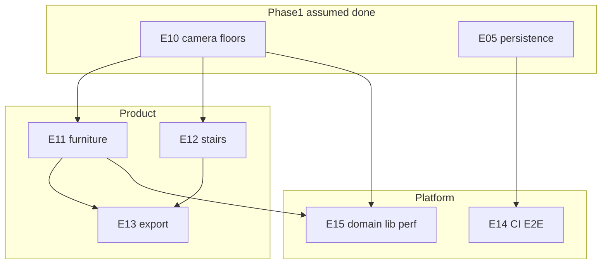
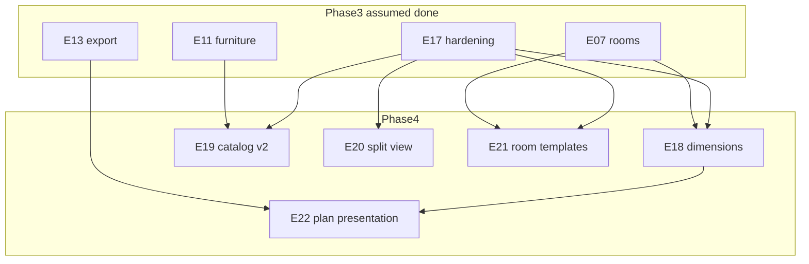

# Editor product roadmap

Status: **Phase 1–4 complete** on `main` — dimensioned plans, catalog v2,
split view, room templates, and plan presentation are shipped alongside
furniture, stairs, PNG/SVG/glTF/360 export, CI/Playwright,
`@sandbox/editor-core`, and the mobile-first shell.
Each epic has a dedicated spec under [`docs/epics/`](./epics/).

Owners: editor (`apps/editor`) + ui-kit (`libs/ui-kit`) +
`libs/editor-core` (Epic 15) and CI (Epic 14).

## 1. Goals

### Phase 1

1. Grow the sandbox from a single-page primitive demo into a **Planner
   5D–style room editor**: walls, rooms, openings, floor/wall materials,
   and geometric primitives.
2. Ship a real **app shell** with routing and sidebar navigation so the
   product has Projects, Editor, and Kit Docs as first-class surfaces.
3. Persist scenes in **IndexedDB** (prefs stay in `localStorage`); support
   multi-project CRUD and JSON export/import. No backend in this roadmap.
4. Document `@sandbox/ui-kit` **in-app** (native overview + live demos) and
   keep Storybook as the interactive deep dive (hybrid).
5. Land work as **independent PRs** that leave `pnpm lint`, `typecheck`,
   `test`, and `build` green, without regressing the shared 2D ↔ 3D
   document model.

### Phase 2

6. Add a **small built-in furniture catalog** (chair / table / bed / wardrobe
   presets — not a marketplace).
7. Connect floors with **stairs** and ship **PNG / SVG / glTF** export for
   the active floor.
8. Harden the platform: **CI + Playwright smoke + coverage**, then extract
   framework-agnostic domain into `libs/editor-core` and cut the three.js
   main-chunk cost.

### Phase 3

9. Ship a **mobile-first responsive shell** (viewport breakpoints): drawer
   nav and editor sheets below `lg`, desktop dual-panel layout at `lg+`.
10. Harden the shipped app (Epic 17): compact mobile chrome, migrate-on-read,
    stair undo pairs, Pages Storybook path, duplication fixes.

### Phase 4

11. Close the biggest gaps vs Planner 5D / Sweet Home 3D / Floorplanner /
    RoomSketcher **without** backend, marketplace, or photoreal: dimensioned
    2D plans, a larger categorized catalog, split 2D+3D, room-by-gesture +
    templates, and presentation-quality plan export.

## 2. Current state (shipped)

- **Monorepo**: Nx 23 + pnpm workspaces. Three packages: `apps/editor`
  (Nuxt 4, port 4300), `libs/ui-kit` (Vue 3 + Storybook 10 on 4400),
  `libs/editor-core` (domain, persistence, history, snap). Node 22.
- **Routes**: `/` project library (IndexedDB CRUD), `/editor/:projectId`
  room editor, `/docs/**` kit docs + Storybook embed.
- **Domain** (`@sandbox/editor-core`): `SceneDocument` with shapes,
  walls, rooms, openings, furniture, stairs, floors, settings,
  snapshots/migrations (`schemaVersion` 7), history, snap.
- **Editor UI**: 2D SVG + 3D three.js (lazy), inspector (kind / rotation
  / scale), scene panel, furniture catalog, export PNG/SVG/glTF/JSON,
  camera orbit/top/walk.
- **Shell**: sidebar at `lg+`, drawer + editor sheets below `lg` (Epic
  16). Epic 17 compact toolbar + sheet a11y + IDB migrate-on-read.
- **Theming**: `createThemeContext()` in `app.vue`, `UiThemeSwitcher` in
  the shell; FOWT boot script in `nuxt.config.ts`.
- **CI / E2E**: GitHub Actions + Playwright smoke + coverage gates.

## 3. Product decisions (locked)

| Topic | Decision |
|-------|----------|
| Planner depth (Phase 1) | Walls, rooms, doors/windows, floor/wall materials, primitives. |
| Furniture (Phase 2) | **Small built-in catalog** (chair, table, bed, wardrobe). No marketplace, no user mesh upload. |
| Furniture (Phase 4) | Catalog **v2**: 12–20 procedural presets, categories + search. Still no marketplace / mesh upload. |
| Persistence | IndexedDB for projects; `localStorage` for prefs (theme already). |
| Kit docs | Hybrid: native Nuxt overview pages + Storybook embed/link. |
| Export (Phase 2) | PNG (3D view), SVG (2D plan), glTF (active floor). JSON project file stays Epic 05. |
| Export (Phase 4) | Dimensioned / annotated plan SVG+PNG; simple 360 capture from walk camera. No PDF packs, no DXF. |
| Domain packaging (Phase 2) | Extract to `libs/editor-core` after furniture lands (Epic 15). |

## 4. Target architecture

```
ProjectRecord
  id, name, updatedAt, schemaVersion
  floors[]
    FloorDocument
      settings: SceneSettings      // background, field, floor look
      shapes: SceneObject[]        // primitives
      walls: WallObject[]          // segments
      rooms: Room[]                // derived + editable materials
      openings: Opening[]          // doors / windows on walls
      furniture: FurnitureObject[] // Phase 2+4 catalog instances
      stairs: StairObject[]        // Phase 2 inter-floor links
      dimensions: DimensionLine[]  // Phase 4 user dimension annotations
```

- **Vue bridge**: `createEditorDocumentContext()` stays scoped to the
  editor route; layouts never own the document.
- **Render contract**: keep `ISceneRenderer` (`mount` / `render` /
  `dispose` + `onSelect` / `onMove`). New callbacks are optional.
- **Shared vocabulary**: shapes, textures, and furniture **icons/presets
  metadata** live in ui-kit; walls / openings / stairs / furniture /
  dimensions **instances** live in `@sandbox/editor-core`.
- **Snapshots**: `schemaVersion` from Epic 05; migrations live in
  `libs/editor-core` and bump with entity additions (walls, rooms, floors,
  furniture, stairs, dimensions).

### Target routes (after Epic 01)

| Path | Role |
|------|------|
| `/` | Project library |
| `/editor/:projectId` | Room editor |
| `/docs` | ui-kit documentation hub |
| `/docs/storybook` | Static Storybook (prod) or link to `:4400` (dev) |

## 5. Epic index

### Phase 1

| # | Slug | Branch | Depends on | Spec |
|---|------|--------|------------|------|
| 01 | App shell, routing, sidebar | `epic/01-app-shell` | — | [01-app-shell.md](./epics/01-app-shell.md) |
| 02 | ui-kit docs (hybrid) | `epic/02-kit-docs` | 01 | [02-kit-docs.md](./epics/02-kit-docs.md) |
| 03 | Object inspector + replace kind | `epic/03-object-inspector` | 01 | [03-object-inspector.md](./epics/03-object-inspector.md) |
| 04 | Scene background + field settings | `epic/04-scene-environment` | 01 | [04-scene-environment.md](./epics/04-scene-environment.md) |
| 05 | Projects in IndexedDB | `epic/05-project-persistence` | 01 (prefer after 03+04) | [05-project-persistence.md](./epics/05-project-persistence.md) |
| 06 | Walls | `epic/06-walls` | 05 | [06-walls.md](./epics/06-walls.md) |
| 07 | Rooms + floor/wall materials | `epic/07-rooms-materials` | 06 | [07-rooms-materials.md](./epics/07-rooms-materials.md) |
| 08 | Doors and windows | `epic/08-openings` | 06 | [08-openings.md](./epics/08-openings.md) |
| 09 | History + precision | `epic/09-history-precision` | 03 (stronger after 06) | [09-history-precision.md](./epics/09-history-precision.md) |
| 10 | Camera modes + floors | `epic/10-camera-floors` | 07 | [10-camera-floors.md](./epics/10-camera-floors.md) |

### Phase 2

| # | Slug | Branch | Depends on | Spec |
|---|------|--------|------------|------|
| 11 | Furniture catalog | `epic/11-furniture-catalog` | 10 | [11-furniture-catalog.md](./epics/11-furniture-catalog.md) |
| 12 | Stairs between floors | `epic/12-stairs` | 10 | [12-stairs.md](./epics/12-stairs.md) |
| 13 | Scene export (PNG / SVG / glTF) | `epic/13-export` | 11, 12 | [13-export.md](./epics/13-export.md) |
| 14 | CI, E2E, quality gates | `epic/14-ci-e2e` | 05 | [14-ci-e2e.md](./epics/14-ci-e2e.md) |
| 15 | Domain lib + perf / tech debt | `epic/15-domain-lib-perf` | 10, 11 | [15-domain-lib-perf.md](./epics/15-domain-lib-perf.md) |

### Phase 3

| # | Slug | Branch | Depends on | Spec |
|---|------|--------|------------|------|
| 16 | Responsive layout (mobile-first) | `epic/16-responsive-layout` | 01, 03, 04 | [16-responsive-layout.md](./epics/16-responsive-layout.md) |
| 17 | Hardening (chrome + persistence) | `epic/17-hardening` | 05, 09, 12, 16 | [17-hardening.md](./epics/17-hardening.md) |

### Phase 4

| # | Slug | Branch | Depends on | Spec |
|---|------|--------|------------|------|
| 18 | Dimensioned 2D plan | `epic/18-dimensioned-plan` | 07, 09, 17 | [18-dimensioned-plan.md](./epics/18-dimensioned-plan.md) |
| 19 | Furniture catalog v2 | `epic/19-catalog-v2` | 11, 17 | [19-catalog-v2.md](./epics/19-catalog-v2.md) |
| 20 | Split 2D + 3D view | `epic/20-split-view` | 16, 17 | [20-split-view.md](./epics/20-split-view.md) |
| 21 | Room gesture + templates | `epic/21-room-templates` | 07, 17 | [21-room-templates.md](./epics/21-room-templates.md) |
| 22 | Plan presentation export | `epic/22-plan-presentation` | 13, 18 | [22-plan-presentation.md](./epics/22-plan-presentation.md) |

### Dependency graph (Phase 1)



### Dependency graph (Phase 2)



### Recommended branch order

**Phase 1**

1. `epic/01-app-shell`
2. Parallel: `epic/03-object-inspector` + `epic/04-scene-environment`
3. `epic/05-project-persistence`
4. `epic/02-kit-docs` anytime after 01
5. `epic/06-walls`
6. Parallel: `epic/07-rooms-materials` + `epic/08-openings`
7. `epic/09-history-precision`
8. `epic/10-camera-floors`

**Phase 2**

9. `epic/14-ci-e2e` anytime after 05 (can run in parallel with product)
10. Parallel: `epic/11-furniture-catalog` + `epic/12-stairs`
11. `epic/13-export`
12. `epic/15-domain-lib-perf` after 11 (furniture already in the domain)

**Phase 3**

13. `epic/16-responsive-layout` after Phase 2 shell/editor chrome is stable
14. `epic/17-hardening` after 16 (audit follow-up)

**Phase 4**

15. `epic/18-dimensioned-plan` first (closes the largest gap vs SH3D / RoomSketcher)
16. Parallel: `epic/19-catalog-v2` + `epic/21-room-templates`
17. `epic/20-split-view` after chrome is stable (16/17)
18. `epic/22-plan-presentation` after 18 (and preferably 13 already merged)

### Dependency graph (Phase 4)



## 6. Branch and PR rules

- Branch name: `epic/NN-slug` matching the tables above.
- Commits: conventional (`feat(editor):`, `feat(ui-kit):`, `docs:`, …).
- One epic ≈ one PR (or a short stack of PRs that merge only when DoD is
  met). Do not mix unrelated epics on one branch.
- After merge, mark the epic spec Status line as **implemented** and link
  the PR (same pattern as `docs/tailwind-migration-plan.md`).

## 7. Definition of Done (every epic)

1. Spec acceptance criteria in the epic file are met.
2. `pnpm lint`, `pnpm lint:style`, `pnpm typecheck`, `pnpm test`,
   `pnpm build` pass on Node 22.
3. No regression of existing 2D ↔ 3D sync for shapes (selection, drag,
   surface, color) unless the epic explicitly replaces that behavior.
4. New domain APIs have unit tests; new Vue surfaces have component tests
   where practical.
5. README touch only when user-facing scripts or routes change.
6. Phase 2 Epic 14 additionally requires the CI workflow to stay green on
   the default branch.

## 8. Out of scope (entire roadmap)

- Accounts, cloud sync, multiplayer / collaboration
- Backend API or auth
- Furniture **marketplace**, user-uploaded meshes, parametric kitchens
- Photorealistic / path-traced rendering; 4K/8K AI renders
- Planner 5D–style AI (photo → plan), LiDAR capture, VR walkthroughs
- DXF / CAD export
- Replacing Storybook with MDX-only docs
- PDF print packs with annotations; cloud share links
- Elevators; spiral stairs; full slab CSG for stair openings
- Chromatic / full visual-regression SaaS (one Playwright screenshot
  smoke is enough in Epic 14)

### Phase 4 swap candidates (not scheduled)

If one of 18–22 is deferred, prefer these frontend-only substitutes (still
no backend): multi-select + align + wall-snap; blueprint image underlay;
simple scene lights (day/evening); electrical 2D symbol layer; wall
elevation / section view (after split view).

## 9. How to use this roadmap

1. Pick the next epic from the recommended order (or any epic whose
   `Depends on` are already merged).
2. Open the matching file under `docs/epics/`.
3. Create branch `epic/NN-slug` from `main` (or current integration branch).
4. Implement against that epic’s domain / UI / file / test checklist.
5. Open a PR; keep the epic markdown as the source of truth for review.
